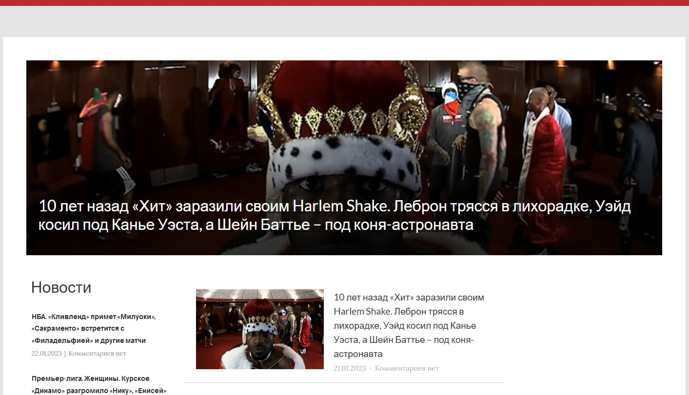
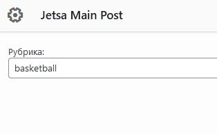

# wp_headliner
Plugin named `jetsa-main-post`. Used for display headliner for wordpress
## How to use
1) Add & activate plugin from WP console
2) Use it as widget
3) In widget settings enter your category
4) Create new category `headliner`
5) While creating/editing post choose a headliner and category in 3)

### How it looks on front

### How it looks on settings

